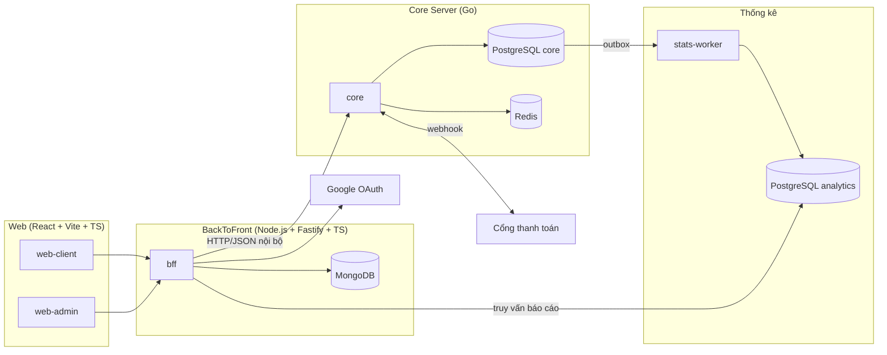

# Kiến trúc

## Tổng quan

## Các tầng

| Tầng | Thành phần | Vai trò |
|---|---|---|
| **Web** | `web-client`, `web-admin` | Giao diện SPA (build tĩnh, phục vụ qua CDN). Chỉ gọi BFF. |
| **BackToFront** | `bff` | Xác thực Google, quản lý session, phân quyền admin, gom/định dạng dữ liệu cho UI, rate limit, cache. Lưu dữ liệu mềm (profile, session, preference, audit log) trong MongoDB. |
| **Core** | `core` | **Nguồn sự thật** cho tồn kho ghế, đơn hàng, vé, ví. Mọi logic ảnh hưởng tính đúng đắn nằm ở đây. |
| **Thống kê** | `stats-worker` | Tiêu thụ sự kiện từ outbox của core, ghi vào PostgreSQL analytics dạng fact/aggregate. |

## Nguyên tắc thiết kế

1. **Core là modular monolith** — một service, chia module theo nghiệp vụ với ranh giới chặt. Xem [ADR-0001](adr/0001-modular-monolith-core.md).
2. **Một nguồn sự thật cho tiền và ghế** — chỉ `core` được ghi vào dữ liệu ghế, đơn hàng, ledger. BFF không bao giờ tự tính tiền.
3. **Web không gọi thẳng core** — core không public ra internet; BFF là cổng duy nhất.
4. **Tách OLTP / OLAP** — báo cáo đọc từ analytics DB, không đọc từ core DB.
5. **Idempotent mọi nơi** — mọi lệnh ghi có tác động tiền/ghế đều mang idempotency key.
6. **Sự kiện qua outbox** — ghi sự kiện cùng transaction với dữ liệu nghiệp vụ, không publish trực tiếp.

## Công nghệ

| Thành phần | Stack |
|---|---|
| Web | React, Vite, TypeScript, React Router, shadcn/ui (Tailwind CSS), TanStack Query, React Hook Form + Zod |
| BackToFront | Node.js, Fastify, TypeScript, MongoDB, @fastify/oauth2 (Google), undici, Zod |
| Core | Go, PostgreSQL, pgx, sqlc, goose, chi |
| Thống kê | Go (worker), PostgreSQL (partitioning, materialized view) |
| Cache / lock | Redis |
| Build | Bazel + Gazelle (Go, `com/tm/server`), pnpm workspace (TS, `com/tm/app`) |
| Hạ tầng | Docker Compose, k6, OpenTelemetry, Prometheus, Grafana |

## Yêu cầu phi chức năng

| Chỉ số | Mục tiêu production | Nghiệm thu máy dev (phase 7) |
|---|---|---|
| Thông lượng tìm chuyến | ≥ 5.000 req/s | ≥ 2.000 req/s |
| Thông lượng đặt vé (cao điểm) | ≥ 1.000 booking/s | ≥ 500 booking/s |
| Latency p99 đặt vé | < 300 ms | < 300 ms |
| Latency p99 tìm chuyến | < 150 ms | < 150 ms |
| Chạy dài (bộ nhớ, bloat ổn định) | 24h | 1h |
| Bán trùng ghế | **0** | **0** |
| Sai lệch tiền | **0 đồng** | **0 đồng** |
| Độ trễ dữ liệu thống kê | < 5 phút | < 5 phút |
| Availability | 99,9% | — |

Máy dev: Docker 8 GB RAM / 8 CPU, k6 chạy cùng máy. Cột "Nghiệm thu máy dev" là điều kiện đóng phase 7; cột production là mục tiêu thiết kế.

## Dừng service (graceful shutdown)

Core (P0-T09, `services/core/cmd/server/shutdown.go`) nhận SIGTERM/SIGINT rồi dừng theo thứ tự: `http.Server.Shutdown` với hạn `CORE_SHUTDOWN_TIMEOUT` (đóng listener ngay → kết nối mới bị từ chối, chờ request đang chạy) → hết hạn thì `Close` cưỡng bức → đóng pool PG và **song song** flush telemetry (`Shutdown` của TracerProvider/MeterProvider từ `pkg/otelx`, P0-T10), cả hai chờ tối đa **cùng** hạn: phần hạn còn lại, ít nhất 1 s → thoát. Mỗi mốc là một dòng log có `shutdown_step` (`signal`, `http_stopped`/`timeout`, `pool_closed`/`pool_close_timeout`, `done`). Kết quả flush là một dòng log riêng trước `done`, key `telemetry_flush` = `ok` (INFO) hoặc `failed` (WARN, kèm `err`; collector chết hoặc quá hạn), không có `shutdown_step` và không đổi exit code. Exit `0` khi dừng sạch, `1` khi phải cắt cưỡng bức, đóng pool quá hạn, lỗi listen hoặc lỗi cấu hình; tín hiệu thứ hai → thoát ngay. Chưa có khoảng chờ drain / `/readyz` 503 cho load balancer: rolling deploy không lỗi request (G3) cần phần này ở phase triển khai. Orchestrator phải cho thời gian dừng (`stop_grace_period`, `terminationGracePeriodSeconds`) lớn hơn `CORE_SHUTDOWN_TIMEOUT` + 1 s.

## Observability

- **Tracing**: OpenTelemetry, trace ID truyền từ BFF sang core qua header `traceparent`.
- **SDK Go** (`pkg/otelx`, P0-T10): `otelx.Setup` tạo TracerProvider + MeterProvider export **OTLP/HTTP** (cổng 4318, mặc định `http://localhost:4318`) và đặt global cùng propagator W3C TraceContext + Baggage; lỗi export thành log slog WARN. Cấu hình chỉ bằng env chuẩn `OTEL_*` (bảng trong `local-setup.md`). Resource mặc định do service truyền: core = `service.name=core`, `service.namespace=snaptix` → Prometheus `job="snaptix/core"`. Span PG (`pool.acquire`, `connect`, query) qua `otelpgx` gắn vào `ConnConfig.Tracer`, là con của span request.
- **SDK Node** (bff, P0-T12): `NodeSDK` dựng trong `apps/bff/src/plugins/otel.ts`, khởi động ở entry riêng `src/instrumentation.ts`, nạp **trước** `server.ts` bằng `node --import ./dist/instrumentation.js dist/server.js` (dev: `tsx watch --import ./src/instrumentation.ts src/server.ts`). Phải tách entry vì tsup gom `server.ts` + `app.ts` thành một bundle và `import` tĩnh được hoist: SDK start trong cùng bundle thì fastify/`node:http` đã nạp trước khi bị patch. Instrumentation chỉ bật ba thứ (không dùng `auto-instrumentations-node`, không dùng `@opentelemetry/instrumentation-fastify` đã deprecated):
  - `@opentelemetry/instrumentation-http`: span `SERVER` mỗi request (đọc `traceparent`), metric `http.server.request.duration` (giây) — phần client của `node:http` tắt vì bff gọi ra bằng `fetch`.
  - `@fastify/otel` (`registerOnInitialization`): span `INTERNAL` theo route/hook, cấp `http.route` cho span `SERVER` và metric (route 404 không có `http_route`, không bùng cardinality).
  - `@opentelemetry/instrumentation-undici`: span `CLIENT` + inject `traceparent` cho `fetch` global.
  Export OTLP/HTTP protobuf (mặc định `http://localhost:4318`, endpoint sai → exit 1 như core), propagator W3C TraceContext + Baggage, sampler `parentbased_always_on`. Resource mặc định `service.name=bff`, `service.namespace=snaptix` → Prometheus `job="snaptix/bff"`, cùng dashboard `snaptix-red`. Lỗi nội bộ/export của OTel (diag) đi qua pino JSON mức `warn`. Log pino có `trace_id`/`span_id` bằng `mixin` đọc span active. `OTEL_SDK_DISABLED=true` → không tạo SDK (không export, cũng không chuyển tiếp `traceparent`).
- **Trace xuyên service thử nghiệm** (P0-T12, quyết định A1): `GET bff /healthz?deep=1` gọi `GET core /readyz` (một lần, hạn 2 s, không retry) — không gọi core `/healthz` như chữ của dòng task, vì core `/healthz` không chạm PG còn `/readyz` ping PG nên một trace có đủ **bff → core → PG** (G10, P0-AT07) mà không phải sửa core.
- **Metrics**: Prometheus — RED metrics cho mỗi endpoint, số ghế đang hold, độ trễ outbox, pool connection PG.
- **Logging**: JSON có cấu trúc, luôn kèm `trace_id`, `user_id`, `request_id`. Core: middleware trong `services/core/internal/httpx` nhận/sinh `X-Request-ID`, handler slog lấy `request_id`/`trace_id`/`span_id` từ context, mỗi request một dòng access log (`method`, `route`, `path`, `status`, `latency_ms`, `bytes`).
- **Dashboard**: Grafana (datasource Prometheus + Tempo provision sẵn). Dashboard **RED theo service** (uid `snaptix-red`, thư mục `snaptix`) provisioning từ `deploy/observability/grafana/dashboards/red.json`: biến `service` = label `job` (`<service.namespace>/<service.name>`), Rate (theo service và theo `http_route`), Errors (tỉ lệ 5xx), Duration (p50/p95/p99) trên metric OTel `http.server.request.duration` (Prometheus: `http_server_request_duration_seconds_*`).
- **Luồng local**: app → OTLP (4317/4318) → otel-collector → Tempo (trace) / Prometheus (metric) → Grafana. Cấu hình trong `deploy/observability/`.
  Metric vào Prometheus bằng OTLP push: collector đẩy tới `/api/v1/otlp` của Prometheus (cờ `--web.enable-otlp-receiver`), không qua exporter để scrape. Prometheus chỉ scrape chính nó, self-telemetry của collector (:8888) và `/metrics` của service (từ P0-T07). Metric RED (`http.server.request.duration`) của service Go **chỉ** đi qua OTLP (label `job` = `<service.namespace>/<service.name>`); `/metrics` scrape (job `core`) chỉ có metric runtime Go/process, không có histogram request, để dashboard RED không thấy một service hai lần (quyết định P0-T08).
